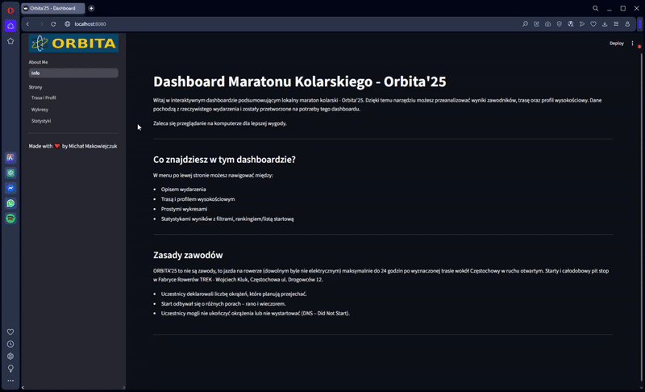

# Dashboard Maratonu Kolarskiego - Orbita'25

Interaktywny dashboard prezentujący lokalny maraton kolarski Orbita'25.  
Pozwala na analizę wyników zawodników, trasę oraz profil wysokościowy trasy.

---

## Opis projektu

Orbita'25 to wydarzenie kolarskie, w którym uczestnicy mogą przejechać do 24 godzin po wyznaczonej trasie wokół Częstochowy.  
Dashboard umożliwia szczegółową analizę wyników, wizualizację trasy oraz statystyk z możliwością interaktywnego filtrowania danych.

---

## Funkcjonalności

- Parsowanie i wizualizacja trasy z pliku GPX z animowanym śladem na mapie
- Profil wysokościowy trasy wraz z segmentacją podjazdów według nachylenia
- Interaktywne wykresy rozkładu uczestników według płci, typu i pory startu
- Szczegółowe statystyki okrążeń i dystansu z możliwością wykluczenia zawodników DNS
- Ranking uczestników z możliwością filtrowania
- Pobieranie trasy w formacie GPX

---

## Demo



---

## Instrukcje uruchomienia

### Wymagania

Możesz zainstalować wymagane pakiety z pliku `requirements.txt`

```bash
pip install -r requirements.txt
```

---

### Uruchomienie aplikacji
W terminalu, w katalogu projektu, wpisz
```bash
streamlit run orbita.py
```

---

Made by Michał Makowiejczuk